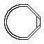
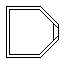
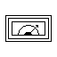
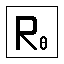
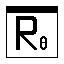
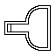

# Interface

The quantum circuit editor qwire consists of three main components:
- Breadboard
- Utensil bal
- Toolbox

The breadboard is the main component of the editor. It allows you to construct circuits using components taken from the toolbox. 

The utensil bar at the top of the interface provides several utensils to interact with your constructed circuit.

Finally, the toolbox contains all components that can be used in qwire. You can minimize it by pressing the white rectangle on its right.

In the following, we will go into more detail on each of these components, and their elements.

# Breadboard
The breadboard is visualized as a grid, where each cell represents a unit size of 1. By dragging your mouse over the editor while holding the left button (while the <a href="#Scroll">scroll tool</a> is selected), you may scroll through the breadboard. On the top right, you see the coordinates of the part of the breadboard you are currently viewing.

<a href="#Components">Components</a> can be added to the circuit by selecting them from the toolbox. While holding a component, a transparent drawing of it will be shown at your current mouse position. If the component cannot be placed, because this part of the circuit is already occupied, it will be indicated by a red highlight.

Some components can be clicked in the breadboard to open up their _details view_. In this view, more specific changed can be made to the component, and it may also contain further analytical information. More information on details views can be found in the <a href="#Components">section on components</a>.

Clicking and dragging a placed component allows users to relocate the components to different positions. 

Clicking a component's socket will select the socket in the editor, highlighting it in an orange hue. After clicking a second socket on a different component, a wire will be created connecting them. Only compatible sockets can be connected (_input_ <-->_output_ | _quantum_ <--> _quantum_ | _classical_ <--> _classical_).

Sockets are indicated in the breadboard by circles at the socket's location. Input sockets are further marked by a black dot in their centre. Quantum sockets can be differentiated from classical sockets by their blue hue.

Simulation is performed automatically after each step if the simulator is not <a href="#Pause">paused</a>. Measurement results gathered during the simulation are indicated by measurement components directly in the circuit view. You may also click measurement components to open their details view for more information on the results.

Many classical circuit editing tools provide the functionality of "splitting" wires along their path to send the information of the current bit two multiple components. Due to the <a href="https://en.wikipedia.org/wiki/No-cloning_theorem">no cloning theorem</a>, creating such copies of qubits is not possible. Therefore, qwire generally does not support the splitting of wires directly. For classical bits, however, qwire provides the <a href="#Fork">Fork</a> component that has the same functionality. 

# Utensils

The utensil bar is located at the very top of the editor. It contains the following utensils in order:

## Scroll

The scroll tool allows the user to drag the circuit to scroll the view, or to drag existing components. While the scroll tool is selected, users may also click components to open their details views.

The scroll tool is the default tool which is automatically selected if no other tool is active, or by pressing the "Esc" key. 

Picking a component from the toolbar deactivates the scroll tool.

## Eraser
The eraser can be used to remove existing components from the circuit. In doing so, all the component's details view modifications, as well as its connected wires are lost as well.

While the eraser is active, moving the mouse over a component in the circuit will highlight it in a red tone.

Picking a component from the toolbar or selecting the scroll tool deactivates the eraser.

## Snap
While the snap setting is active, any movement of the mouse in the breadboard is "snapped" to the grid lines. This can be used to place components in a more precise manner next to each other.

The snap tool is selected while the "Alt" button is held. Releasing the "Alt" button will also deactivate the snap tool.

## Undo / Redo
The undo and redo utensils can be used to rewind the last modifications made by the user on the circuit.

Please note that undo and redo only affect modifications made to the grid directly, not any modifications made inside a component's details view.

Undo / redo can be called using the shortcuts `ctrl + z` and `ctrl + y` respectively.

## Save / Load
The save utensil downloads a json encoding of the current circuit to your device.

The load component allows users to upload such circuit encodings to the editor and loads them into the workspace.

## Play / Pause

The play / pause button is located on the very right of the utensil bar. It can be used to activate / deactivate qwire's statevector simulator. While the simulator is active, a simulation is run after each change made to the circuit.

Pausing the simulator will prevent such simulation runs. Please keep in mind that measurement results will not update while the simulator is paused.

# Components

The toolbox on the left of the editor consists of a list of components that can be added to your circuit. In this section, we will go into more detail on each of these components. 

For a more rigorous introduction to quantum computing, please visit <a href="https://qiskit.org/textbook/preface.html">qiskit's textbook</a>.

## Tools
Tools represent the most basic components that are required to construct (meaningful) circuits: _Sources_ and _Measurements_. Each circuit requires at least one source component to be run.

Qwire distinguishes _classical_ and _quantum_ components. Therefore, a distinction between _classical_ and _quantum_ sources and measurements also has to be made to construct such circuits.

    

    
image

    

    

name

    

<strong>description</strong>

    

<strong>details view</strong>

    

    
    

    

Source (classical)

    

Generates one classical bit. The state of the bit (<em>ON</em>/<em>OFF</em> ) can be set using the details view.

    

Click the slider to change the source state from <em>ON</em> to <em>OFF</em>.

    

    
    

    

Source (quantum)

    

Generates one quantum bit. The state vector of the bit can be set using the details view.

    

Enter coefficients for the |0⟩ or |1⟩ states by clicking one of the states and entering a number through your keyboard. The coefficient of the opposing state is updated automaticalls so that their squared sum equals 1.

    

    
    

    

Measurement (classical)

    

Measures a classical bit. If the bit is <em>ON</em>, the component in the circuit lights up in green.

    

A larger display indicating the measured value of the bit.

    

    
    

    

Measurement (quantum)

    

Measures a quantum bit. The probabilities of states |0⟩ and |1⟩ are indicated by the ratios of the dark and light colours lighting up respectively.

    

A bar chart that shows the probability of each measurement result. By clicking one of the three group names at the top, the component is added to a measurement group.Multiple measurements of the same groups will always be measured together (i.e. the measurement results affect each other), and will have their results displayed together.

## Classical Gates

Classical gates represent circuit components that only require classical bits for their computation. As they do not need to be included in the statevector simulator with exponential blow-up, even large numbers of classical gates and bits can be supported and calculated in real-time.

In principle, most classical gates supported by qwire implement the default logical operations of boolean algebra.

    

    
image

    

    

name

    

<strong>description</strong>

    

<strong>details view</strong>

    

    
    

    

NOT Gate

    

Inverts the classical bit:  0 ⇒ 1, or 1 ⇒ 0

    

/

    

    
    

    

AND Gate

    

Takes two classical bit as input and has an output 1 if and only if both inputs are 1.

    

/

    

    
    

    

OR Gate

    

Takes two classical bit as input and has an output 1 if at least one of the inputs is 1.

    

/

    

    
    

    

NAND Gate

    

Inverted AND Gate. Has an output of 1, unless both inputs are 1.

    

/

    

    
    

    

NOR Gate

    

Inverted AND Gate. Has an output of 1 only if both inputs are 0.

    

/

    

    
    

    

XOR Gate

    

Takes two classical bit as input and has an output 1 if <em>exactly</em> one of the inputs is 1.

    

/

    

    
    

    

XNOR Gate

    

Inverted XOR Gate. Has an output of 1 if <em>both</em> inputs are either 1 or 0.

    

/

    

    
    

    

OR Gate

    

Takes two classical bit as input and has an output 1 if at least one of the inputs is 1.

    

/

    
    

    
    

    

Fork

    

Splits the wire into two equal outputs. Can be used to copy the value of the bit to two different components.

    

/

## Single-Qubit Gates
Single-Qubit gates are unitaries that operate on just one qubit. All quantum gates can be defined as unitary matrices. In this document, we will define gates by the action they perform on an arbitrary qubit of the form a|0⟩ + b|1⟩.

The most commonly used and basic single-qubit gates are the three Pauli gates: X, Y, and Z.

    

    
image

    

    

name

    

<strong>description</strong>

    

<strong>details view</strong>

    

    
    

    

X Gate

    

The Pauli X gate is the quantum version of the NOT gate.  a|0⟩ + b|1⟩ ⇒ a|1⟩ + b|0⟩

    

/

    

    
    

    

Y Gate

    

The Pauli Y gate combines the X and Z gates and futher adds a factor of "i" to the qubit:  a|0⟩ + b|1⟩ ⇒ ai|1⟩ - bi|0⟩

    

/

    

    
    

    

Z Gate

    

The Pauli Z gate represents a negative phase shift to the |1⟩ state while leaving the |0⟩ state unchanged:  a|0⟩ + b|1⟩ ⇒ a|0⟩ - b|1⟩

    

/

 
Another important single-qubit gate is the <em>Hadamard</em> gate: 

    

    
    

    

Hadamard

    

Creates an equal superposition from a state in the computational basis:  a|0⟩ + b|1⟩ ⇒ a|+⟩ - b|-⟩ Where |+⟩ = (|0⟩ + |1⟩)/&radic;2, 
    |-⟩ = (|0⟩ - |1⟩)/&radic;2 

    

/

 
Finally, qwire supports three phase-shift gates: S, T, and Rθ. These gates all leave the state |0⟩ untouched, while transforming the state |1⟩ with a given phase shift.

    

    
    

    

S Gate

    

Multiplies the phase of |1⟩ by the imaginary constant i:  a|0⟩ + b|1⟩ ⇒ a|0⟩ + bi|1⟩

    

/

    

    
    

    

T Gate

    

Multiplies the phase of |1⟩ by eiπ/4:  a|0⟩ + b|1⟩ ⇒ a|0⟩ + beiπ/4|1⟩

    

/

    

    
    

    

Rθ Gate

    

Multiplies the phase of |1⟩ by eiθ for a given value of θ:  a|0⟩ + b|1⟩ ⇒ a|0⟩ + beiθ|1⟩

    

Select a value of theta as a linear combination of π and 1 by clicking the input fields and typing the values. The view on the left shows the angle θ on the unit circle.

## Multi-Qubit Gates
Multi-Qubit Gates take multiple qubits as inputs. Unlike classical gates, quantum gates must be _reversible_. This means that the number of input and output qubits for a quantum gate must always be equal.

The most common types of two-qubit gates are _controlled_ gates. These gates take two qubits as input, a control qubit and a target qubit. It then performs a given action on the target qubit if the control qubit is equal to |1⟩. Otherwise, it keeps the target unchanged. If the control qubit is in a super position, the gate is only applied partially to the target, with a factor determined by the coefficient of |1⟩ in the control qubit.

For instance, the _CX_ or _CNOT_ gate performs the X gate on a target qubit. The transformation rules for it are:
$|00\rangle \rightarrow |00\rangle$, $|01\rangle \rightarrow |01\rangle$, $|10\rangle \rightarrow |11\rangle$, $|11\rangle \rightarrow |10\rangle$ \
if the leftmost qubit is the control, or more general:
$$\alpha|00\rangle + \beta|01\rangle + \gamma|10\rangle + \delta|11\rangle \rightarrow \alpha|00\rangle + \beta|01\rangle + \gamma|11\rangle + \delta|10\rangle $$

In qwire, controlled gates are indicated by a black bar at the top. The control qubit is given through the input socket at the very top, and corresponds to the topmost output socket. The following controlled two-qubit gates are available:

    

    
image

    

    

name

    

<strong>description</strong>

    

<strong>details view</strong>

    

    
    

    

CX Gate

    

Applies the Pauli X gate to qubit 2 (left input) if the control (top input) is |1⟩

    

/

    

    
    

    

CY Gate

    

Applies the Pauli Y gate to qubit 2 (left input) if the control (top input) is |1⟩

    

/

    

    
    

    

CZ Gate

    

Applies the Pauli Z gate to qubit 2 (left input) if the control (top input) is |1⟩

    

/

    

    
    

    

Controlled Hadamard

    

Applies the Hadamard gate to qubit 2 (left input) if the control (top input) is |1⟩

    

/

    

    
    

    

CS Gate

    

Applies the S gate to qubit 2 (left input) if the control (top input) is |1⟩

    

/

    

    
    

    

CT Gate

    

Applies the T gate to qubit 2 (left input) if the control (top input) is |1⟩

    

/

    

    
    

    

CRθ Gate

    

Applies the Rθ gate to qubit 2 (left input) if the control (top input) is |1⟩

    

Select a value of theta as a linear combination of π and 1 by clicking the input fields and typing the values. The view on the left shows the angle θ on the unit circle.

 

Controlled gates are not limited just one control qubit. Generally in quantum computing, controlled gates may have any number of control qubits, and are expected to perform their action on the target qubit if and only if **ALL** controls are in the state $|1\rangle$. 

Qwire supports the _CCX_ or _CCNOT_ gate, also known as _Toffoli gate_, which applies the Pauli X gate if both inputs (passed through the two topmost input sockets) are equal to $|1\rangle$. The three output sockets correspond to the left and right control qubits and to the action qubit in order.

    

    
    

    

CCNOT Gate

    

Applies the Pauli X gate to qubit 3 (left input) if both control inputs (top) are in state |1⟩

    

/

 
One final common two-qubit gate is the SWAP gate. It swaps the values of two given qubits. Generally, this gate plays less of an important role in qwire, as the position of gates and the directions of layers can be chosen arbitrarily, while usually, quantum circuits are designed with fixed horizontal lines as their quantum wires.

    

    
    

    

SWAP Gate

    

Swaps the values of two input qubits. The value of the top input will be passed to the bottom output, and the bottom input will be passed to the top output

    

/

## UI Blocks
UI Blocks are non-functional components provided by qwire to improve the legibility of constructed circuits. They do not affect the values of bits or qubits passing through them, but can be used to structure wires and components in the breadbox.

    

    
image

    

    

name

    

<strong>description</strong>

    

<strong>details view</strong>

    

    
    

    

Text

    

Text components can be added to the circuit to display some provided text. Single-line only.

    

Open the details view and type in the text you wish to display.

    

    
    

    

Area

    

When placing the area component, select two corner positions. The area is rendered as a rectangle through these corner points that can be used to group related components together. To delete, click the border of the area with the eraser.

    

Click the border of the area to open the details view. Click any of the provided colours to select a background hue for the area.

    

    
    

    

Edge (classical)

    

A single classical bit is passed from the input to the output directly without modifications. Can be used to add right-angle edges to the circuit wiring.

    

/

    

    
    

    

Edge (quantum)

    

A single quantum bit is passed from the input to the output directly without modifications. Can be used to add right-angle edges to the circuit wiring.

    

/

    

    
    

    

Sink (classical)

    

A classical bit can be passed to this component to end the wire. This is not required functionally, but it can improve circuit legibility by removing dangling outputs.

    

/

    

    
    

    

Sink (quantum)

    

A quantum bit can be passed to this component to end the wire. This is not required functionally, but it can improve circuit legibility by removing dangling outputs.

    

/

